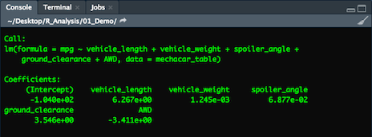
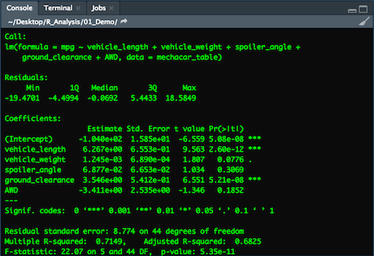
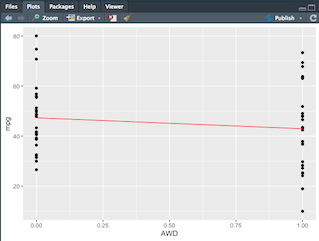
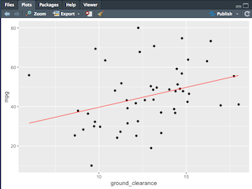
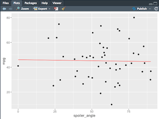
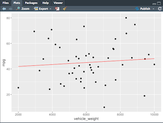
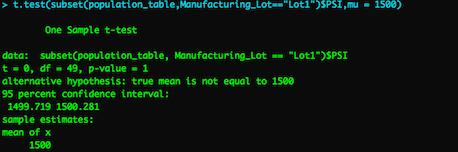
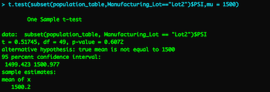
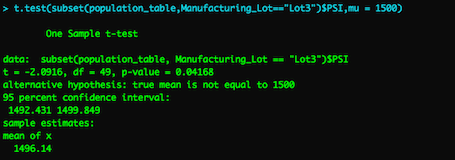

# MechaCar Statistical Analysis

## Analysis Overview
For this analysis we use statistics and hypothesis testing to analyze a series of datasets from the automotive industry. It includes visualizations, statistical tests, and a summarization of the results. We utilize the R programming language to deliver all of our statistical analyses and visualizations specifically for the upcoming Mechacar launch.

## Resources  
- **Data Source:** [MechaCar_mpg.csv](), [Suspension_coil.csv](), [MechaCarChallenge.R]()
- **Software:** R, RStudio, Rtools

## Challenge Objectives

- Which variables/coefficients provided a non-random amount of variance to the mpg values in the dataset?
- Is the slope of the linear model considered to be zero? Why or why not?
- Does this linear model predict mpg of MechaCar prototypes effectively? Why or why not?

## Linear Regression to Predict MPG

- MPG provided a non-random amount of variance to the mpg values in the dataset

- The linear model is a flat line with a slope of zero.

- In my opinion the linear model does not predict mpg of MechaCar prototypes effectively due to there being no visible correlation between the results of the plots and factors given and the desired output.

## T-Tests on Suspension Coils

## T-Test Summary

The conclusion of the T-Tests on the suspension coils shows us that there is no significant difference in the output that require any extreme callouts for our analysis.
