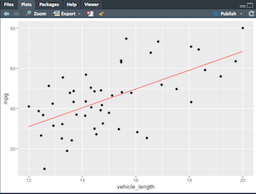

# MechaCar Statistical Analysis

## Analysis Overview
For this analysis we use statistics and hypothesis testing to analyze a series of datasets from the automotive industry. It includes visualizations, statistical tests, and a summarization of the results. We utilize the R programming language to deliver all of our statistical analyses and visualizations specifically for the upcoming Mechacar launch.

## Resources  
- **Data Source:** [MechaCar_mpg.csv](), [Suspension_coil.csv](), [MechaCarChallenge.R]()
- **Software:** R, RStudio, Rtools

## Challenge Objectives

- Which variables/coefficients provided a non-random amount of variance to the mpg values in the dataset?
- Is the slope of the linear model considered to be zero? Why or why not?
- Does this linear model predict mpg of MechaCar prototypes effectively? Why or why not?

## Linear Regression to Predict MPG

- MPG provided a non-random amount of variance to the mpg values in the dataset

- The linear model is a flat line with a slope of zero.

- In my opinion the linear model does not predict mpg of MechaCar prototypes effectively due to there being no visible correlation between the results of the plots and factors given and the desired output.

## T-Tests on Suspension Coils

## T-Test Summary

The conclusion of the T-Tests on the suspension coils shows us that there is no significant difference in the output that require any extreme callouts for our analysis.

## Study Design: MechaCar Vs. Competition

What consumers would be most concerned about is how the MechaCar stacks up against what is already available in the automotive marketplace. They would be concenred most about safety, fuel efficiency, styling & extra features, space and comfort inside the vehicle, and initial cost as well as maintenance cost. These features, metrics and amenities are what consumers care the most about when considering purchasing a car and the MechaCar has to stack up well against the competition when it comes to delivering.

We would test how safe the MechaCar is versus the compatition. Our null hypothesis would be to find out whether or not the MechaCar is safer than the competition when it comes to crash tests and crumple zone strength & reliability.

We would use T-Tests to test the hypothesis and guage whether or not the metrics were better in the MechaCar vs. the competition.

The data that we would need to run these tests would be the historical crash test data of the competition and recent crash testing that was performed with the MechaCar.
